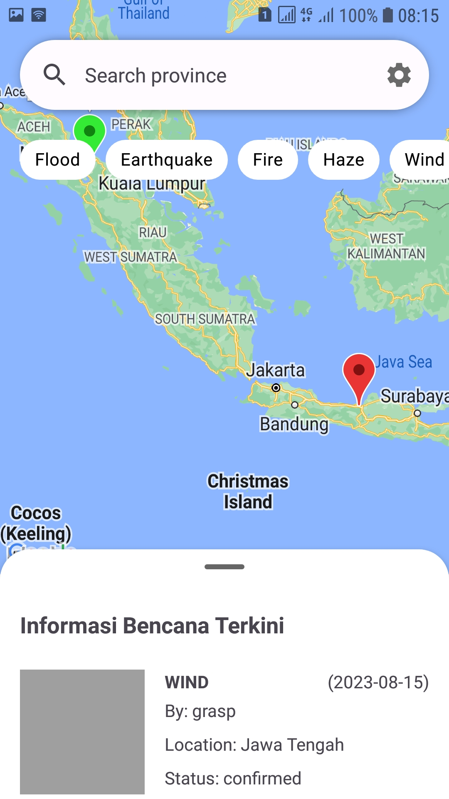
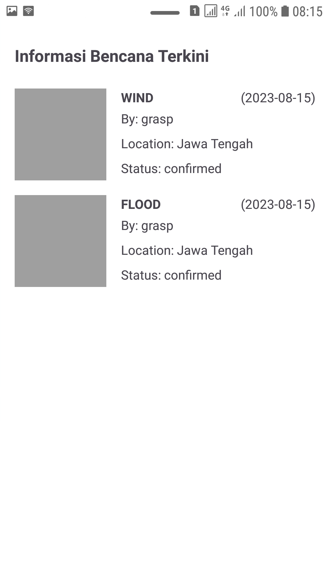
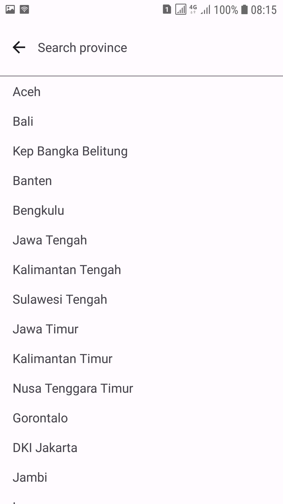
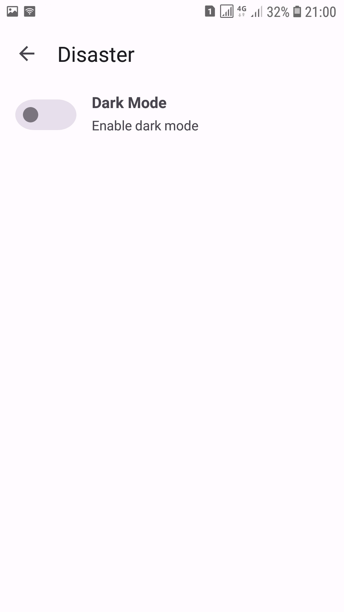
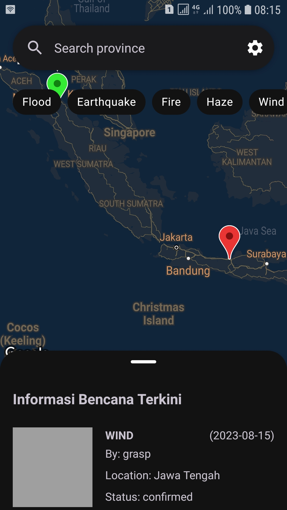
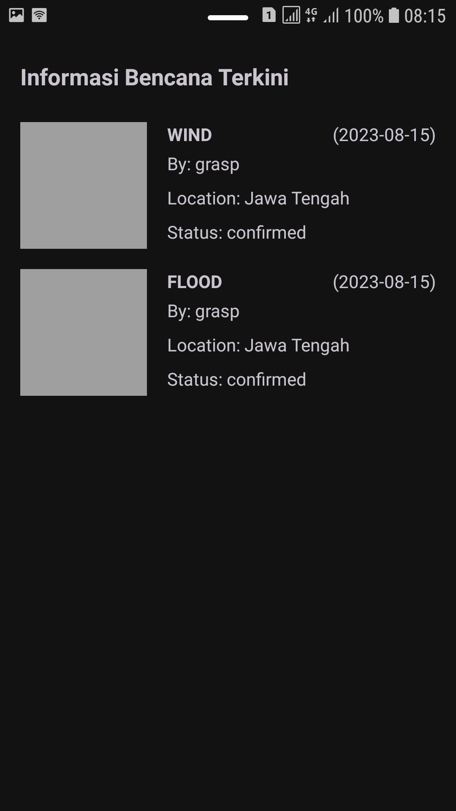
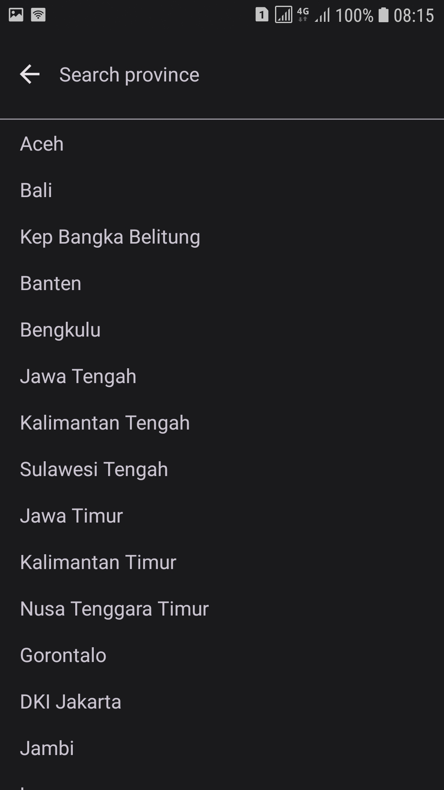
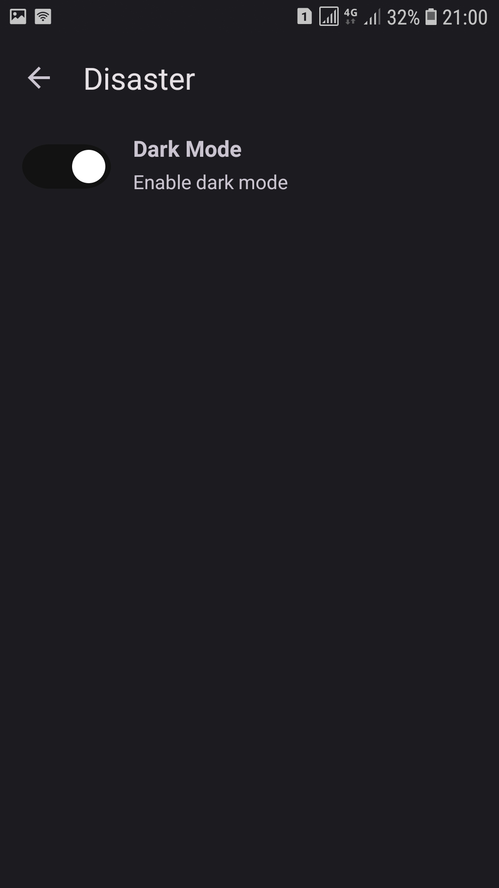
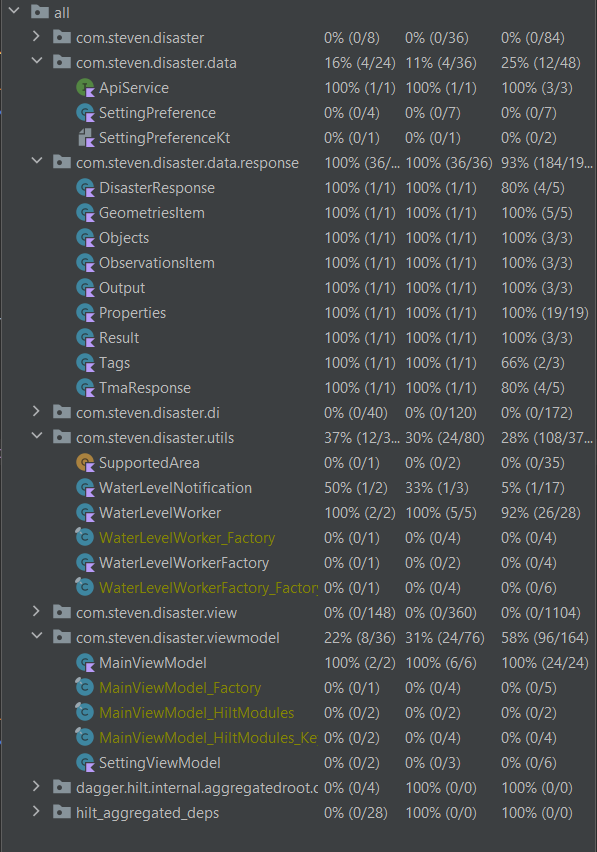

# ME14-Disaster-GG3MEUP0155-StevenLie

## Disaster

Disaster is a mobile application which show information about disaster (such as flood, earthquake,
fire, haze, wind, volcano) that happen in Indonesia. Disaster data is obtained
from [Peta Bencana](https://docs.petabencana.id/).

## Features

+ List disaster in a period of time (last hour)
+ Filterable list (flood, earthquake, fire, haze, wind, volcano)
+ Filter based on area (based on province available in Peta Bencana)
+ Show disaster on Map
+ Notification based on water level
+ Light/dark mode
+ Animation loading

## Installation

### Prerequisites

Please make sure your Android device has API level 24 or higher.

### Clone Project

You can clone this project by running this command

```
git clone "https://github.com/GG-3-0-Mobile-Engineering/ME14-Disaster-GG3MEUP0155-StevenLie.git"
```

### Add Google Maps API Key

Before running the app, make sure you have a Google Maps API key. If you don't have Google Maps API
key, you can follow the
step [here](https://developers.google.com/maps/documentation/android-sdk/get-api-key) to generate
your API key.

After getting the API Key, put your API key in `local.properties` file by adding following code (
change *YOUR_API_KEY* with your Google Maps API key):

```
MAPS_API_KEY=YOUR_API_KEY
```

## Library Used in Project

| Library | Version |
|---|---|
| androidx core | 1.10.1 |
| androidx appcompat | 1.6.1 |
| google material | 1.9.0 |
| androidx constraint layout | 2.1.4 |
| androidx activity | 1.7.2 |
| androidx lifecycle | 2.6.1 |
| google play-services-maps | 18.1.0 |
| google play-services-location | 21.0.1 |
| androidx datastore-preferences | 1.0.0 |
| glide | 4.12.0 |
| retrofit2 | 2.9.0 |
| okhttp3 | 4.10.0 |
| androidx work | 2.8.1 |
| dagger hilt | 2.44 |
| junit 4 | 4.13.2 |
| mockk | 1.13.5 |
| espresso | 3.5.1 |

## Screenshots

### Light Mode
    

### Dark Mode
    

## Instument Test


## Test Coverage


## APK Installation

You can download the .apk file
from [github release](https://github.com/GG-3-0-Mobile-Engineering/ME14-Disaster-GG3MEUP0155-StevenLie/releases/tag/v1.1.0)
